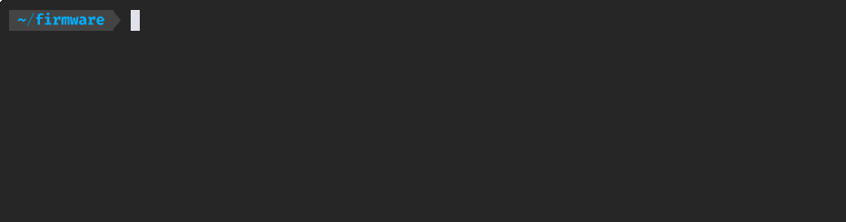

# ZMK-Flasher

A small go cli application to simplify flashing ZMK firmware to ZMK powered split keyboards.
It helps by letting you specify the firmware files of the right and left half by their single files or as a zip and mounting the keyboard bootloaders interactively. Afterwards it will copy the firmware to the keyboard halves.
Currently Linux and MacOS are supported.



## Installation
To install zmk-flasher run
```bash
go install github.com/new-er/zmk-flasher@latest
```

## Usage

To flash a firmware run the following command:
```bash
zmk-flasher flash -l left_firmware.u2f -r right_firmware.u2f
```
This lets you mount the left and right keyboard halves interactively.
Afterwards the application will flash the firmware to the left and right halves.

You can also flash a single firmware file to both halves (Glove 80):
```bash
zmk-flasher flash -a firmware.u2f
```

Or you can directly use a zip file as long as there are two files in it, one containing `left` and the other `right` in the file name.
```
zmk-flasher flash -z firmware.zip
```

To find more about the usage of the application, run the following command:
```bash
zmk-flasher --help
```

## Contributing
Contributions are welcome! Feel free to open issues or submit pull requests.
